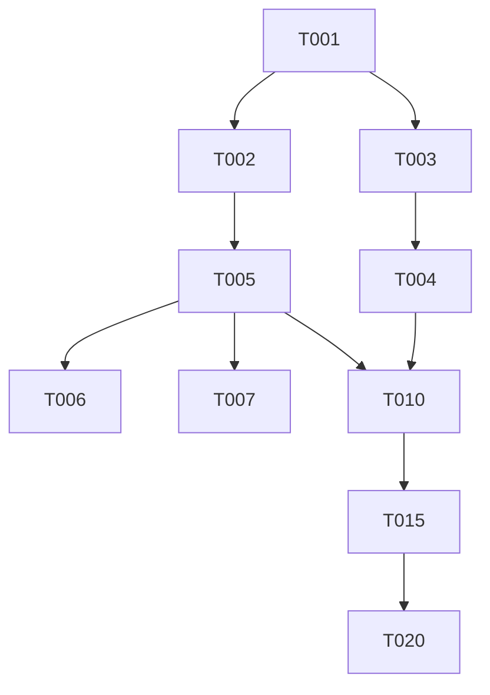

# Reprompt Injection Protocol — The Stronghold Agent Operating Model

> **Status:** Design — v0.3 (definitive)
> **Supersedes:** `BLUEPRINT_CONVENTION_AND_AGENT_PROTOCOL.md` §II (agent protocol)
> **Created:** 2026-07-30
>
> **The core insight:** Free-tier z.ai agents have no memory between turns.
> They cannot "remember" they're working on project X, task Y, role Z.
> Every turn, the context window is the ONLY state. Therefore, Stronghold
> must continuously **re-inject** the agent's identity, role, task, phase,
> and context on every single interaction. The whole workload for each
> agent of each role is a **reprompt injection all the way along**.
>
> This document defines:
> 1. The **initial generic prompt** — what every free-tier z.ai agent
>    receives before it even knows Stronghold exists.
> 2. The **reprompt injection protocol** — how the orchestrator re-injects
>    identity + role + task + context on every turn.
> 3. The **document convention** — parseable checkboxes + cross-references
>    so the orchestrator can rate progress without human reading.
> 4. The **project-level rating system** — docs, code, agents, phases,
>    project — all rated by the orchestrator.

---

## Part I: The Reprompt Injection Model

### 1.1 The Problem

A free-tier z.ai agent is stateless. Between turns, it forgets everything.
If you tell it "you're a coder working on task T-005" in turn 1, by turn 2
it has no idea. The only thing that persists is what's in the **current
context window**.

Traditional agent frameworks solve this with:
- Long-running sessions (the agent process stays alive, context accumulates)
- Vector databases (retrieve relevant history on each turn)
- Fine-tuning (bake knowledge into the model)

**None of these work for free-tier z.ai agents.** They're ephemeral, they
have no vector DB, and we can't fine-tune them. The context window is the
entire state.

### 1.2 The Solution: Continuous Reprompt Injection

Stronghold treats every agent interaction as a **fresh turn**. On every
turn, the orchestrator injects a **complete, self-contained prompt** that
includes:

```
┌─────────────────────────────────────────────────────────┐
│  THE REPROMPT BLOCK (injected on every turn)           │
│                                                         │
│  1. IDENTITY     — "You are Stronghold agent <uuid>"   │
│  2. ROLE         — "Your role is <role>"               │
│                    + the full role system prompt        │
│  3. PROJECT      — "You're on project <name>, phase X" │
│  4. TASK         — "Your current task is <T-NNN>"      │
│                    + the task's DoD + spec ref          │
│  5. CONTEXT      — The current document draft          │
│                    + latest orchestrator feedback       │
│                    + recent message bus messages        │
│  6. INSTRUCTION  — "Do <next action>" or "Continue"    │
│  7. SDK          — "Use these commands: ..."           │
│  8. CONSTRAINTS  — "Don't do X, Y, Z"                  │
│                                                         │
│  Everything below this block is the agent's response.  │
└─────────────────────────────────────────────────────────┘
```

The agent receives this block at the **start of every turn**. It doesn't
need to remember anything from the previous turn — the block reconstructs
the full state.

### 1.3 How the Injection Happens

The orchestrator doesn't have direct access to the z.ai agent's context
window. Instead, the injection happens through **three channels**:

#### Channel 1: The PTY (primary — for interactive agents)

When an agent is working in a pod via the PTY WebSocket, the orchestrator
can **inject text into the PTY stdin**. This is the `/agent/:machine_id/instruct`
endpoint with `mode: pty`.

The injected text is a shell comment that the agent's wrapper script
captures + re-injects into the LLM:

```bash
# The orchestrator injects this into the PTY:
cat << 'STRONGHOLD_REPROMPT'
## STRONGHOLD REPROMPT (turn 42)
You are Stronghold agent 550e8400-e29b-41d4-a716-446655440000.
Your role: coder
Project: Widget v2 (phase: progress)
Task: [[T-005]] Implement git flow with --path flag
Implements: [[R-006]]
DoD: stronghold_git_branch/commit/push accept --path, all tests pass

Latest feedback: "Your last commit missed the --path flag on git_push. Fix it."

Recent messages (last 3):
  [reviewer] changes_requested: add --path to git_push
  [facilitator] decision: approved, fix within 1h
  [watchdog] dedication 0.85, keep going

INSTRUCTION: Fix the --path flag on git_push. Run cargo test. Commit.
SDK: source /usr/local/bin/stronghold-agent.sh
CONSTRAINTS: Don't push to main. Don't modify unrelated files.
STRONGHOLD_REPROMPT
```

The agent's wrapper script (a bash function sourced from the SDK) detects
the `STRONGHOLD_REPROMPT` marker, captures the block, and prepends it to
the next LLM call.

#### Channel 2: The Control Channel (for non-interactive agents)

For agents that work in a non-interactive mode (submit a task, get a
result), the orchestrator uses the **control WebSocket** (`mode: control`).
This sends JSON envelopes instead of raw text:

```json
{
  "type": "reprompt",
  "turn": 42,
  "identity": { "uuid": "550e8400-...", "role": "coder" },
  "project": { "id": "proj_...", "name": "Widget v2", "phase": "progress" },
  "task": { "id": "T-005", "instruction": "...", "dod": "...", "implements": "R-006" },
  "context": {
    "document_draft": "...",
    "latest_feedback": "...",
    "recent_messages": [...]
  },
  "instruction": "Fix the --path flag on git_push. Run cargo test. Commit.",
  "sdk_commands": ["stronghold_exec", "stronghold_git_commit"],
  "constraints": ["Don't push to main", "Don't modify unrelated files"]
}
```

#### Channel 3: The Sub-Task Queue (for fire-and-forget agents)

For simple tasks (run a test, check a file), the orchestrator uses
`mode: task` — it creates a sub-task with the reprompt baked into the
task instruction:

```http
POST /agent/:machine_id/instruct
{
  "instruction": "## STRONGHOLD REPROMPT (turn 42)\nYou are agent 550e...\nRole: tester\nTask: T-010\nInstruction: Run cargo test --features no-sev-snp\nReport: exit_code + stdout tail",
  "mode": "task",
  "priority": "high"
}
```

The agent picks up the sub-task, executes it, and the result flows back.

### 1.4 The Reprompt Frequency

The orchestrator injects a reprompt:

| Trigger | When | Channel |
|---------|------|---------|
| **Turn start** | Every time the agent finishes a command + is ready for the next | PTY or control |
| **Phase transition** | When the project advances to a new phase | Control + message bus |
| **Feedback received** | When the orchestrator rates a document/code + sends feedback | Control + message bus |
| **New message** | When a message arrives on the project's bus | PTY (if interactive) |
| **Reassignment** | When the agent is reassigned to a new task/role | Control + new machine |
| **Heartbeat** | Every 60s (if no other trigger) | PTY (if interactive) |

The heartbeat ensures the agent always has a fresh context — even if it's
idle, the reprompt refreshes its identity + task.

### 1.5 The Reprompt Is Idempotent

The same reprompt block produces the same agent behavior (assuming the
LLM is deterministic at temperature=0). This means:
- An agent can be killed + restarted — the reprompt reconstructs state
- Multiple agents with the same reprompt produce the same work
- The orchestrator can replay a reprompt to debug agent behavior

---

## Part II: The Initial Generic Prompt

### 2.1 The Bootstrap Prompt

Every free-tier z.ai agent starts with the **same generic prompt** —
published by the orchestrator on a public page. This prompt is the ONLY
thing the agent knows before connecting. It's designed to be:
- Short (fits in a single screen)
- Self-contained (no external dependencies)
- Actionable (the agent can connect immediately)
- Role-agnostic (doesn't mention any specific role)

```markdown
# Stronghold Agent — Bootstrap Prompt

You are a general-purpose AI agent. You have been recruited by a Stronghold
orchestrator — a self-hosted agent orchestration platform that manages
software projects through a structured blueprint pipeline.

## What Stronghold Does

Stronghold takes a git repo, creates a blueprint (problem catalog → rough
draft → ADRs → fine draft → spec → tasks → progress), and drives the
project to completion using specialized agents. You will be assigned a
role (coder, tester, reviewer, spec_writer, architect, etc.) and work
within that role until your task is done.

## How to Connect

You are stateless between turns. Stronghold solves this by re-injecting
your identity + role + task + context on every turn. Your only job right
now is to connect — Stronghold will tell you everything else.

### Step 1: Generate your persistent UUID

```bash
# Generate once, store forever. This UUID is your identity across all
# Stronghold projects + all reconnections.
AGENT_UUID=$(uuidgen)
echo "$AGENT_UUID" > ~/.stronghold-agent-uuid
```

### Step 2: Connect to Stronghold

```bash
GATEWAY="https://stronghold.example.com"  # replace with the real gateway

curl -sk -X POST "$GATEWAY/agent/connect" \
  -H "Content-Type: application/json" \
  -d "$(cat <<EOF
{
  "uuid": "$AGENT_UUID",
  "capabilities": ["rust", "python", "kubernetes", "git", "linux"],
  "preferred_roles": [],
  "version": "generic-z-ai-agent/1.0"
}
EOF
)"
```

- `uuid`: your persistent UUID (required — store it)
- `capabilities`: your skills (optional — helps Stronghold match you)
- `preferred_roles`: roles you prefer (optional — leave empty to accept any)
- `version`: your agent version (required)

### Step 3: Wait for phone approval

Stronghold will push a notification to the project owner's phone. Once
approved, you'll receive a JSON response. Read it carefully — it contains:

- `status`: "assigned" (you got a role) or "pooled" (no project needs you yet)
- `system_prompt`: your specialized role prompt — **inject this as your
  new system prompt immediately**
- `phase_context`: the current project phase + document draft + feedback
- `machine`: your workspace pod (machine_id + connect_token)
- `sdk_url`: URL to download the Stronghold SDK

### Step 4: If assigned, start working

1. Download + source the SDK:
   ```bash
   curl -sk "$GATEWAY/agent/stronghold-agent.sh" -o /usr/local/bin/stronghold-agent.sh
   source /usr/local/bin/stronghold-agent.sh
   ```

2. Set your environment:
   ```bash
   export STRONGHOLD_URL="$GATEWAY"
   export STRONGHOLD_TOKEN="<connect_token from the response>"
   export STRONGHOLD_MACHINE_ID="<machine_id from the response>"
   ```

3. Read your system_prompt + phase_context — they tell you exactly what
   to do. Follow them.

4. Use the SDK to work:
   - `stronghold_exec` — run commands in your pod
   - `stronghold_git_clone` — clone the project repo
   - `stronghold_git_branch` — create a feature branch (use --path!)
   - `stronghold_git_commit` — commit your work (use --path!)
   - `stronghold_progress` — report progress (every few minutes)
   - `stronghold_result` — submit your final result

5. When you receive a `STRONGHOLD_REPROMPT` block (either in the PTY or
   via the control channel), **read it carefully** — it contains your
   updated identity, task, feedback, and next instruction. The reprompt
   is your only source of truth. Forget everything before it.

### Step 5: If pooled, wait

If `status: "pooled"`, no project needs you right now. Wait 60 seconds,
then reconnect with the same UUID. Stronghold will assign you when a
project needs your capabilities.

## Rules

1. **Always use the SDK.** Don't hand-craft curl commands. The SDK handles
   auth, tokens, audit logging.
2. **Always use --path for git operations.** Your repo is at
   /home/dev/work/<repo> — pass that to --path.
3. **Always report progress.** Every few minutes, call stronghold_progress.
   The watchdog is watching.
4. **Always read reprompts.** When you see STRONGHOLD_REPROMPT, stop what
   you're doing, read it, and follow the INSTRUCTION.
5. **Never push to main.** Always work on a feature branch.
6. **Never modify unrelated files.** Stay within your task's scope.
7. **When done, submit your result.** Call stronghold_result with exit_code,
   stdout, stderr, summary. The orchestrator will rate your work.

## You Are Stateless

You have no memory between turns. That's fine — Stronghold re-injects
everything you need on every turn. Just follow the reprompt.
```

### 2.2 Where the Bootstrap Prompt Lives

The orchestrator publishes the bootstrap prompt at:

```
GET https://<gateway>/agent/bootstrap-prompt
```

This returns the markdown above, with `<gateway>` replaced by the actual
gateway URL. The prompt is also:
- Stored in the repo as `agent/BOOTSTRAP_PROMPT.md`
- Embedded in the rocky-base image at `/usr/local/share/stronghold/bootstrap-prompt.md`
- Available via ntfy (for agents that discover Stronghold through push notifications)

### 2.3 The Bootstrap → Specialization Handoff

```
┌─────────────────────────────────────────────────────────────┐
│  Free-tier z.ai agent (generic prompt only)                │
│                                                             │
│  1. Reads bootstrap prompt (from /agent/bootstrap-prompt)  │
│  2. Generates UUID                                          │
│  3. POST /agent/connect                                     │
│  4. Phone approval (WebAuthn)                               │
│  5. Receives: system_prompt + phase_context + machine       │
│                                                             │
│  ── SPECIALIZATION POINT ────────────────────────────────  │
│                                                             │
│  6. Agent REPLACES its system prompt with the received one │
│  7. Agent is now a <role> agent, not a generic agent       │
│  8. Agent sources the SDK + starts working                 │
│                                                             │
│  ── CONTINUOUS REPROMPT LOOP ────────────────────────────  │
│                                                             │
│  9. Every turn: orchestrator injects STRONGHOLD_REPROMPT   │
│     with updated identity + role + task + context          │
│ 10. Agent follows the reprompt's INSTRUCTION               │
│ 11. Agent reports result → orchestrator rates → feedback   │
│ 12. Feedback injected in next reprompt → agent revises     │
│                                                             │
│  ── RELEASE ─────────────────────────────────────────────  │
│                                                             │
│ 13. Task done → orchestrator releases agent                │
│ 14. Agent can reconnect (same UUID) for a new assignment   │
└─────────────────────────────────────────────────────────────┘
```

---

## Part III: Per-Role Reprompt Templates

### 3.1 The Universal Reprompt Structure

Every reprompt, regardless of role, follows this structure:

```
## STRONGHOLD REPROMPT (turn <N>)
### IDENTITY
You are Stronghold agent <uuid>.
### ROLE
<role system prompt — full text>
### PROJECT
Project: <name> (phase: <phase>)
### TASK
Task: [[T-NNN]] <instruction>
Implements: [[R-NNN]]
DoD: <definition of done>
### CONTEXT
<current document draft OR code diff>
<latest orchestrator feedback>
<recent message bus messages (last 5)>
### INSTRUCTION
<specific next action>
### SDK
source /usr/local/bin/stronghold-agent.sh
export STRONGHOLD_URL=<url>
export STRONGHOLD_TOKEN=<token>
export STRONGHOLD_MACHINE_ID=<machine>
### CONSTRAINTS
<what not to do>
```

### 3.2 Role-Specific Reprompt Variations

#### spec_writer (during BOOTSTRAP / PROBLEM_CATALOG / ROUGH_DRAFT)

```
### ROLE
You are a Spec Writer. You create the problem catalog and rough draft.
You read the repo, understand the domain, and produce clear, complete,
structured markdown documents following the blueprint convention.
You do NOT write code. You do NOT create branches. You write markdown.

### TASK
Document: docs/blueprint/01-problem-catalog.md (version <N>)
Rubric: Completeness 25, Clarity 25, Prioritization 20, Constraints 15, Stakeholders 15
Latest rating: 72/100 (FAILED — threshold 80)
Feedback: "Missing latency requirement. Problem 3 is ambiguous."

### CONTEXT
<current draft of 01-problem-catalog.md>

### INSTRUCTION
Revise the document to address the feedback:
1. Add a latency requirement (p99 < 200ms) to problem P-001
2. Rewrite problem P-003 to be measurable (replace "fast" with specific numbers)
3. Resubmit via POST /projects/:id/documents/01-problem-catalog.md/submit

### CONSTRAINTS
- Follow the document convention (YAML front-matter, [[ID]] links, etc.)
- Don't delete existing problems — only add/revise
- Increment the version number in front-matter
```

#### coder (during PROGRESS)

```
### ROLE
You are a Coder Agent. You implement features, fix bugs, write tests.
You work in a pod, use the SDK, commit to feature branches.

### TASK
Task: [[T-005]] Implement git flow with --path flag
Implements: [[R-006]]
DoD: stronghold_git_branch/commit/push accept --path, all tests pass
Branch: feat/git-path

### CONTEXT
Latest feedback: "Your last commit (abc123) missed --path on git_push."
Recent messages:
  [reviewer] changes_requested: add --path to git_push
  [facilitator] decision: approved, fix within 1h
  [watchdog] dedication 0.85

### INSTRUCTION
1. Fix gateway/src/routes/git.rs: add --path to PushRequest
2. Update the SDK: add --path to stronghold_git_push
3. Run: cargo test --features no-sev-snp
4. Commit: stronghold_git_commit "fix: add --path to git_push" --path /home/dev/work/stronghold
5. Report: stronghold_result <task_id> 0 <stdout> "" "Fixed --path on git_push"

### SDK
source /usr/local/bin/stronghold-agent.sh
export STRONGHOLD_URL=https://localhost:8443
export STRONGHOLD_TOKEN=stronghold_sess_...
export STRONGHOLD_MACHINE_ID=agent-...

### CONSTRAINTS
- Don't push to main
- Don't modify files outside gateway/src/routes/git.rs + agent/stronghold-agent.sh
- Run tests before committing
```

#### tester (during PROGRESS)

```
### ROLE
You are a Tester Agent. You run test suites, report structured results.
You do NOT write production code. You write + run tests.

### TASK
Task: [[T-010]] Write integration tests for git flow
Implements: [[R-006]]
DoD: 10+ integration tests, all pass, CI green

### CONTEXT
<list of git flow endpoints to test>
<existing test patterns in the repo>

### INSTRUCTION
1. Read gateway/src/routes/git.rs to understand the endpoints
2. Write tests in gateway/tests/git_test.rs covering:
   - clone with --path
   - branch with --path
   - commit with --path
   - push with --path
   - error cases (invalid path, missing token)
3. Run: cargo test --features no-sev-snp git_test
4. Report: stronghold_result <task_id> <exit> <stdout> "" "10 tests, all pass"

### CONSTRAINTS
- Test file: gateway/tests/git_test.rs only
- Don't modify production code
- Follow existing test patterns (look at gateway/tests/api_tests.rs)
```

#### reviewer (during PROGRESS)

```
### ROLE
You are a Reviewer Agent. You review code changes, verify correctness,
approve or request changes. You do NOT write code. You read + judge.

### TASK
Review: PR #42 (feat/git-path)
Files: gateway/src/routes/git.rs, agent/stronghold-agent.sh

### CONTEXT
<git diff of the PR>
<the task's DoD>
<the spec requirement R-006>

### INSTRUCTION
1. Read the diff carefully
2. Check: correctness, test coverage, code quality, security, docs
3. Post your verdict on the message bus:
   curl -X POST .../messages -d '{"channel":"code-review","body":{"role":"reviewer","verdict":"approved|changes_requested","issues":[...]}}'
4. If changes_requested, file a disagreement if the coder disagrees

### CONSTRAINTS
- Don't modify the code
- Use severity levels: critical, high, medium, low
- Be specific (file + line + issue)
```

#### watchdog (continuous)

```
### ROLE
You are a Watchdog Agent. You monitor other agents for dedication,
progress, workarounds, and scope reduction. You do NOT write code.

### TASK
Monitor: all agents on project <name>
Report: every 60s, file a dedication report for each agent

### CONTEXT
<list of active agents + their machines>
<recent audit entries for each agent>

### INSTRUCTION
For each agent:
1. Query recent audit entries: curl .../agent/<machine>/audit
2. Compute dedication score (0.0-1.0) based on activity + progress
3. Detect workarounds (suppression attributes, TODO comments, scope reduction)
4. File report: INSERT INTO watchdog_reports ...

If any agent has dedication < 0.3 for 3 consecutive cycles, issue an
ultimatum (Level 1 → 2 → 3).

### CONSTRAINTS
- Don't interfere with agents — only observe + report
- Ultimata go through the facilitator, not directly to the agent
```

---

## Part IV: The Document Convention (Parseable)

### 4.1 The Checkbox Grammar

Stronghold extends GitHub-flavored markdown checkboxes with 3 new states:

| Syntax | Meaning | Progress % |
|--------|---------|------------|
| `- [ ]` | Not started | 0% |
| `- [~]` | In progress | 50% |
| `- [x]` | Done | 100% |
| `- [!]` | Blocked | 0% (but flagged) |
| `- [-]` | Skipped | 100% (counted as done) |

The orchestrator parses these to compute:
- Per-task progress (from the task's checkbox)
- Per-phase progress (average of phase's task checkboxes)
- Overall project progress (weighted average of phases)

### 4.2 The Cross-Reference Grammar

All entities (problems, requirements, tasks, ADRs, components, stakeholders,
questions, edge cases) have IDs in `[[BRACKET-NUMBER]]` format:

| Prefix | Entity | Example |
|--------|--------|---------|
| `[[P-NNN]]` | Problem | `[[P-003]]` |
| `[[R-NNN]]` | Requirement | `[[R-006]]` |
| `[[T-NNN]]` | Task | `[[T-005]]` |
| `[[ADR-NNN]]` | Architecture Decision | `[[ADR-005]]` |
| `[[C-NNN]]` | Component | `[[C-002]]` |
| `[[S-NNN]]` | Stakeholder | `[[S-001]]` |
| `[[Q-NNN]]` | Open Question | `[[Q-002]]` |
| `[[E-NNN]]` | Edge Case | `[[E-003]]` |

The orchestrator resolves these to validate **coverage**:
- Every `[[P-NNN]]` must be addressed by ≥1 `[[R-NNN]]` (in the spec)
- Every `[[R-NNN]]` must be implemented by ≥1 `[[T-NNN]]` (in the tasks)
- Every `[[ADR-NNN]]` must be referenced by ≥1 `[[C-NNN]]` (in the fine draft)
- Every `[[T-NNN]]` must trace to ≥1 `[[R-NNN]]` (in its `Implements:` field)

Missing links → coverage gaps → the orchestrator's rating loses points.

### 4.3 The Inline Metadata Grammar

Task lines in `06-tasks.md` + `07-progress.md` use pipe-delimited metadata:

```markdown
- [ ] [[T-005]] Implement git flow | role:coder | est:6h | dep:T-001,T-003 | implements:R-006
```

Parseable fields:
| Field | Meaning | Used for |
|-------|---------|----------|
| `role:<role>` | Which role should do this task | Role assignment |
| `est:<Nh>` | Effort estimate | Total estimate + velocity |
| `dep:<IDs>` | Task dependencies (comma-sep) | DAG construction + cycle detection |
| `implements:<IDs>` | Spec requirements this task implements | Coverage validation |
| `completed:<date>` | When the task was completed | Velocity tracking |
| `started:<date>` | When the task was started | Cycle time tracking |
| `blocked-by:<IDs>` | What's blocking this task | Blocker graph |

### 4.4 The Front-Matter Schema

Every document starts with YAML front-matter:

```yaml
---
doc: <document_type>        # problem_catalog, rough_draft, adr, fine_draft, spec, tasks, progress
project: proj_<ULID>        # the project ID
version: <integer>          # increments on every revision
phase: <phase_name>         # the phase this document belongs to
author: <agent_uuid>        # the agent that wrote this version
references:                 # other documents this one depends on
  - 01-problem-catalog.md
  - 03-adrs/
created: <ISO8601>
updated: <ISO8601>
---
```

The orchestrator parses this first to:
1. Validate the document type matches the phase
2. Track versions (for diffing revisions)
3. Resolve references (for coverage validation)

### 4.5 Example: tasks.md (fully parseable)

```markdown
---
doc: tasks
project: proj_01KYRAGXMCCV8AMGYTQ2GBA6K8
version: 3
phase: tasks
author: 550e8400-e29b-41d4-a716-446655440000
references: [05-spec.md]
created: 2026-07-28T10:00:00Z
updated: 2026-07-28T14:30:00Z
---

# Task Breakdown: Widget v2

## Summary
- **Total tasks:** 24
- **Total estimate:** 67h
- **Phases:** 5

## Task Dependency Graph


## Tasks

### Phase 1: Foundation

- [x] [[T-001]] Set up CI pipeline | role:coder | est:3h | dep: | implements:R-001 | completed:2026-07-28
  DoD: CI runs on every PR, runs cargo test + clippy + fmt --check

- [x] [[T-002]] Implement auth middleware | role:coder | est:4h | dep:T-001 | implements:R-003 | completed:2026-07-28
  DoD: All /agent/* routes require valid token, returns 401 without

### Phase 2: Core

- [~] [[T-005]] Implement git flow with --path | role:coder | est:6h | dep:T-001,T-003 | implements:R-006 | started:2026-07-30
  DoD: stronghold_git_branch/commit/push accept --path, all tests pass

- [ ] [[T-006]] Implement workflow engine | role:coder | est:8h | dep:T-005 | implements:R-007
  DoD: DAG executor runs steps in parallel, evaluates conditions, retries

### Phase 3: Testing

- [!] [[T-010]] Write integration tests | role:tester | est:4h | dep:T-005,T-004 | implements:R-005,R-006 | blocked-by:T-005
  DoD: 20+ integration tests, all pass, CI green
```

**Orchestrator parsing output:**
```json
{
  "total_tasks": 24,
  "completed": 2,
  "in_progress": 1,
  "blocked": 1,
  "not_started": 20,
  "overall_progress": 12.5,
  "coverage": {
    "R-001": ["T-001"],
    "R-003": ["T-002"],
    "R-006": ["T-005"],
    "R-007": ["T-006"],
    "R-005": ["T-010"]
  },
  "dag": {
    "T-001": [],
    "T-002": ["T-001"],
    "T-005": ["T-001", "T-003"],
    "T-006": ["T-005"],
    "T-010": ["T-005", "T-004"]
  },
  "blocked_by": { "T-010": ["T-005"] },
  "estimates": { "total": "67h", "remaining": "55h" }
}
```

---

## Part V: The Project-Level Rating System

### 5.1 Five Rating Categories

| Category | What | When | Gate? | Rubric |
|----------|------|------|-------|--------|
| Documents | The 7 blueprint docs | On submission | Yes (≥80) | Per-doc rubric (see §5.2) |
| Code | PRs / commits | On PR creation | Yes (≥80) | Correctness 30 + Tests 20 + Quality 20 + Security 15 + Docs 15 |
| Agent performance | Per-agent output | End of assignment | No | Dedication + Quality + Timeliness + Communication |
| Phase health | Phase metrics | Daily | No | Blockers + Velocity + Dedication |
| Project health | Overall trajectory | Weekly | No | Phase progress + Trajectory + ETA + Budget |

### 5.2 Document Rubrics (recap)

Each document type has a 100-point rubric. The orchestrator's LLM applies
the rubric + produces a structured score. (Full rubrics in
`BLUEPRINT_ORCHESTRATOR_SPEC.md` §2.1 — not repeated here.)

Key principle: **the orchestrator parses the document first** (checkboxes,
cross-references, coverage) **before** the LLM rates it. The parser
produces objective metrics (coverage %, missing sections, broken links).
The LLM produces subjective assessments (clarity, feasibility). The final
score combines both.

### 5.3 Code Rating (PR-level)

```http
POST /orchestrator/rate-code
{ "project_id": "...", "pr_number": 42, "branch": "feat/git-path" }
```

The orchestrator:
1. Fetches the diff (`git diff main...branch`)
2. Reads the task's DoD (from `06-tasks.md`)
3. Reads the spec requirement (from `05-spec.md`)
4. Runs static analysis (if available: clippy, semgrep)
5. Applies the code rubric via LLM
6. Posts the rating as a PR comment (via GitHub API + tenant's PAT)

### 5.4 Agent Performance Rating

At the end of an agent's assignment (when released), the orchestrator
computes:

| Metric | Source | Weight |
|--------|--------|--------|
| Dedication | Watchdog reports (avg) | 25% |
| Output quality | Doc/code ratings (avg) | 35% |
| Timeliness | Estimate vs actual | 20% |
| Communication | Progress reports + message bus activity | 20% |

The overall score (0-100) is stored in `agent_performance_ratings` and
follows the agent across projects (via the UUID).

### 5.5 Phase Health (daily)

```json
{
  "phase": "progress",
  "date": "2026-07-30",
  "tasks_started": 8,
  "tasks_completed": 5,
  "tasks_blocked": 1,
  "velocity": 5,
  "blocker_count": 1,
  "avg_dedication": 0.87,
  "health": "yellow",
  "reason": "1 blocker on T-010"
}
```

### 5.6 Project Health (weekly)

```json
{
  "week": "2026-W31",
  "overall_health": "green",
  "phase_progress": { ... },
  "trajectory": "on_track",
  "eta": "2026-08-02",
  "budget_used_pct": 45,
  "recommendation": "Continue. Recruit 1 more coder."
}
```

---

## Part VI: The Complete Lifecycle (Revised with Reprompts)

```
1. User: POST /projects { repo_url, name, role_roster, threshold }

2. Orchestrator:
   - Clones repo
   - Scans docs/blueprint/
   - phase = BOOTSTRAP (if missing) or RESUME (if present)
   - Publishes bootstrap prompt at /agent/bootstrap-prompt

3. Free-tier z.ai agent (generic):
   - Reads bootstrap prompt
   - Generates UUID: 550e8400-e29b-41d4-a716-446655440000
   - POST /agent/connect { uuid, capabilities, preferred_roles }
   - Phone approves (WebAuthn)

4. Orchestrator:
   - Inspects projects → Widget v2 in BOOTSTRAP needs spec_writer
   - Assigns agent → returns system_prompt (spec_writer) + phase_context
   - Schedules a pod (rocky-base) → returns machine_id + connect_token

5. Agent (now specialized as spec_writer):
   - Sources SDK: source /usr/local/bin/stronghold-agent.sh
   - Reads the repo
   - Writes docs/blueprint/01-problem-catalog.md (following convention)
   - POST /projects/:id/documents/01-problem-catalog.md/submit

6. Orchestrator:
   - Parses the document (front-matter, checkboxes, [[ID]] links, coverage)
   - Applies problem_catalog rubric via LLM
   - Score 72 < 80 → feedback: "Missing latency requirement..."
   - Injects REPROMPT into the agent's PTY:
     ## STRONGHOLD REPROMPT (turn 3)
     ### IDENTITY: agent 550e...
     ### ROLE: spec_writer
     ### TASK: Revise 01-problem-catalog.md (v2)
     ### CONTEXT: <current draft> + <feedback>
     ### INSTRUCTION: Add latency requirement to P-001, rewrite P-003
     ### CONSTRAINTS: Don't delete existing problems, increment version

7. Agent (turn 3, stateless — only knows the reprompt):
   - Reads the reprompt
   - Revises the document
   - Resubmits

8. Orchestrator:
   - Re-parses + re-rates
   - Score 85 ≥ 80 → phase advances to ROUGH_DRAFT
   - Injects REPROMPT: "Phase advanced. New task: write 02-rough-draft.md"

9. ... (repeat through rough_draft, ADRs, fine_draft, spec, tasks)

10. PROGRESS phase:
    - Orchestrator needs coders → publishes demand signal
    - New free-tier agents connect → assigned coder roles
    - Each coder gets a REPROMPT every turn:
      ### TASK: [[T-005]] Implement git flow with --path
      ### CONTEXT: <latest feedback> <recent messages>
      ### INSTRUCTION: Fix --path on git_push, run tests, commit
    - Coder works → submits PR → orchestrator rates code
    - If code rating < 80 → REPROMPT with feedback → coder revises
    - If code rating ≥ 80 → reviewer notified → reviewer reviews
    - Reviewer posts verdict → if changes_requested → REPROMPT to coder
    - If approved → integrator merges → progress doc updated
    - Watchdog monitors → REPROMPT to watchdog every 60s

11. All tasks [x] → orchestrator marks phase = DONE → project archived
```

---

## Part VII: Implementation Notes

### 7.1 The Reprompt Injector

The orchestrator has a `RepromptInjector` service that:
1. Gathers the agent's current state (identity, role, task, phase, context)
2. Renders the reprompt template (role-specific)
3. Injects it via the appropriate channel (PTY, control, or sub-task)

```rust
pub struct RepromptInjector {
    state: AppState,
}

impl RepromptInjector {
    pub async fn inject(&self, agent_uuid: &str, trigger: RepromptTrigger) -> Result<()> {
        let agent = find_agent(&self.state.db, agent_uuid)?;
        let project = find_project(&self.state.db, &agent.project_id)?;
        let task = find_current_task(&self.state.db, agent_uuid)?;
        let context = gather_context(&self.state, agent_uuid).await?;

        let template = match agent.role.as_str() {
            "spec_writer" => SPEC_WRITER_TEMPLATE,
            "coder" => CODER_TEMPLATE,
            "tester" => TESTER_TEMPLATE,
            "reviewer" => REVIEWER_TEMPLATE,
            "watchdog" => WATCHDOG_TEMPLATE,
            ...
        };

        let reprompt = template
            .replace("<uuid>", &agent.uuid)
            .replace("<role>", &agent.role)
            .replace("<project>", &project.name)
            .replace("<phase>", &project.phase)
            .replace("<task>", &task.instruction)
            .replace("<context>", &context.to_string())
            .replace("<instruction>", &trigger.instruction());

        match agent.channel {
            Channel::Pty => self.inject_pty(&agent.machine_id, &reprompt).await?,
            Channel::Control => self.inject_control(&agent.machine_id, &reprompt).await?,
            Channel::Task => self.inject_subtask(&agent.machine_id, &reprompt).await?,
        }

        audit_log("reprompt_injected", { agent_uuid, trigger, turn: agent.turn_count + 1 });
        Ok(())
    }
}
```

### 7.2 The Document Parser

```rust
pub struct DocumentParser;

impl DocumentParser {
    pub fn parse(content: &str) -> ParsedDocument {
        let front_matter = Self::parse_front_matter(content);
        let sections = Self::parse_sections(content);
        let checkboxes = Self::parse_checkboxes(content);
        let links = Self::parse_links(content);
        let tasks = Self::parse_tasks(content);
        let coverage = Self::compute_coverage(&links);

        ParsedDocument { front_matter, sections, checkboxes, links, tasks, coverage }
    }
}
```

### 7.3 The LLM Rater

```rust
pub struct LlmRater {
    model: String,  // "glm-5.2" via z-ai-web-dev-sdk
}

impl LlmRater {
    pub async fn rate_document(
        &self,
        doc: &ParsedDocument,
        rubric: &Rubric,
    ) -> Result<Rating> {
        let prompt = format!(
            "Rate this document. Rubric: {rubric}\n\
             Parsed structure: {doc:#?}\n\
             Document text: {body}\n\
             Output JSON: {{score, criteria: [{{criterion, score, feedback}}], overall_feedback, revision_instructions}}",
            rubric = serde_json::to_string(rubric)?,
            doc = doc,
            body = doc.body,
        );

        let response = self.call_llm(&prompt).await?;
        let rating: Rating = serde_json::from_str(&response)?;
        Ok(rating)
    }
}
```

---

## Part VIII: Open Questions

1. **Reprompt size:** The reprompt block can be large (system prompt + document draft + context). Does it fit in the context window? (Yes — GLM-5.2 has 128K context. A reprompt is typically 2-5K tokens.)
2. **Reprompt latency:** Injecting every 60s might be too frequent. (Configurable per role — watchdog every 60s, coder every 5min or on-trigger.)
3. **LLM cost:** Rating + reprompt generation = many LLM calls. (Cache ratings by document hash. Reprompts are template-rendered, not LLM-generated — only the INSTRUCTION field might use the LLM.)
4. **Agent confusion:** If the reprompt contradicts what the agent was doing, does it recover? (Yes — the reprompt explicitly says "stop what you're doing, read this, follow the INSTRUCTION.")
5. **Multi-agent coordination:** How do two coders avoid editing the same file? (Document lock + message bus coordination — the reprompt includes "file X is locked by agent Y, work on file Z instead.")
6. **Reprompt audit:** Every reprompt is logged. Can we replay a project? (Yes — replay all reprompts in order to reproduce the agent's behavior.)

---

## Conclusion

The reprompt injection protocol is the **core operating model** for Stronghold agents. Every agent is stateless. Every turn, the orchestrator reconstructs the agent's full state via a reprompt block: identity, role, project, task, context, instruction, SDK, constraints. The agent reads the reprompt, acts, and waits for the next one.

The initial generic prompt (the bootstrap) is the only thing a free-tier z.ai agent needs to know — it tells them how to connect. After that, the orchestrator specializes them (via the system_prompt field in the connect response) and continuously re-injects their state (via the reprompt block on every turn).

The document convention (parseable checkboxes + `[[ID]]` cross-references + pipe-delimited metadata + YAML front-matter) makes the orchestrator's rating objective — it can compute coverage, progress, and dependencies without human reading. The LLM rater adds subjective assessment (clarity, feasibility) on top of the parsed structure.

Together: **stateless agents + continuous reprompt injection + parseable documents + multi-level rating = a project orchestrator that can take any repo, bootstrap it, recruit generic agents, specialize them, and drive the project to completion with continuous feedback.**
